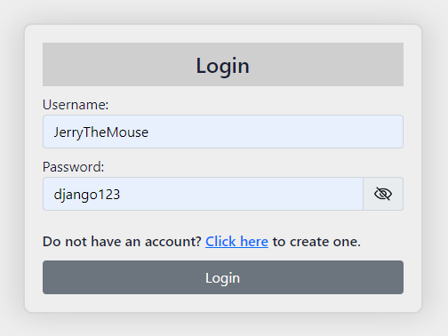
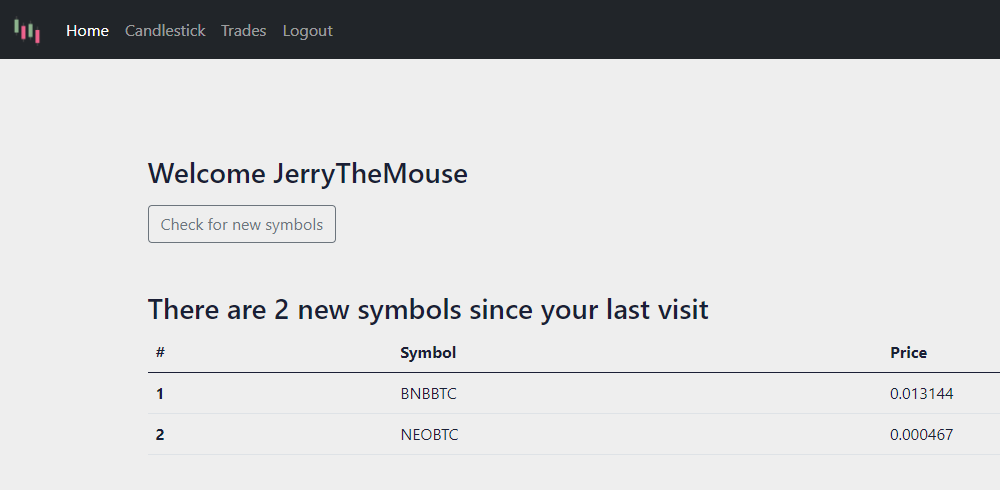
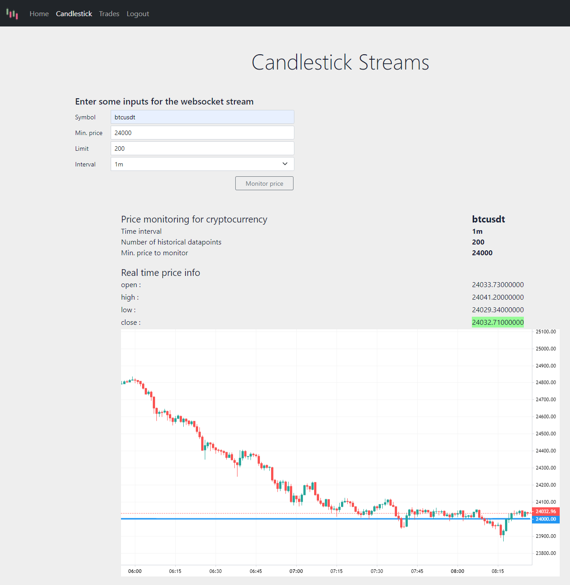
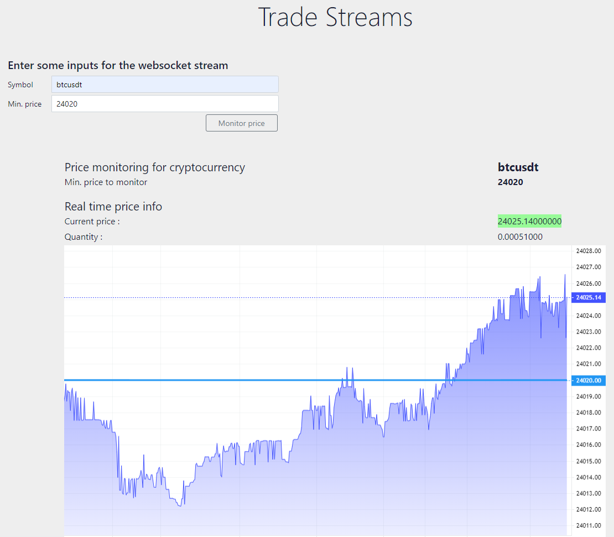

## WebSocket and Binance 

This repository contains Jupyter notebooks for both backend chalenges, as well as the Django application.

### **Console part**

Create virtual environment:
```
python -m venv myenv
```

Activate myenv (windows):
```
myenv\Scripts\activate
pip install -r requirements.txt
```

Start the script:
```
python part_2.py
```
It will fetch the data from binance api using websocket and display it in the console. You can set some input variables in the script file:
- symbol : cryptocurrency symbol to monitor, e.g. btcusdt
- interval : time interval (1m, 3m, 5m, 15m, 30m, 1h, 2h, 4h, 6h, 8h, 12h, 1d)
- price_tag : price to monitor, 'o' - open, 'h' - high, ...
-convert_time : whether to convert time from milliseconds to another time format using pandas

### **Juputer Notebooks**

There are two jupyter notebooks for the app:
- websocket_stream_part_1.ipynb : part 1 using trade stream,
- websocket_stream_part_2.ipynb : part 2 using candlestick stream.

They are self-explanatory.


### **Django app**

Django app demonstrating solutions for both parts is within directory **binance_project**.
I'm hosting the app with pythonanywhere, you can visit and play around.
[https://BinanceStream.pythonanywhere.com](https://BinanceStream.pythonanywhere.com)

To start the app, create virtual environment:

```
python -m venv myenv
myenv\Scripts\activate

cd binance_project
pip install -r requirements.txt

python manage.py runserver
```


##### **Index page**

It will ask you to login. You can do so using the **username** : JerryTheMouse and **password** : django123.



Once you login, you can check for the latest criptocurrency symbols. For the purpose of the demo I deleted two records from db. On the button click, it will fetch info about current cryptocurrency symbols and their prices, compare it with the existing data in the db (under your username) and find those that are new.



##### **Candlestick streams**

Define several input variables (described in the Console part).
On the button click, it will fetch the hystorical data for a given symbol and interval for the last **limit** points and then will start the websocket streaming the data and updating the graph in the real-time.




##### **Trade streams**

Similar to the candlestick streams, upon the button click it will start the websocket streaming the real-time data from binance api and also generate the chart with current price (area shaded) and minimal price that you set within input settings. Once the current price is above the minimal price, the minimal price div will be collored green and a short harph sound will be played, indicating that you can for instance start trading.


